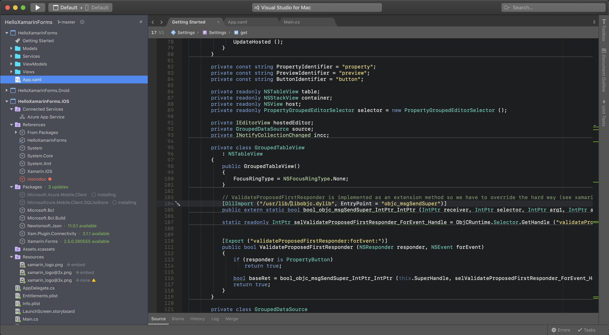
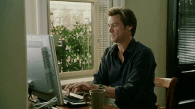
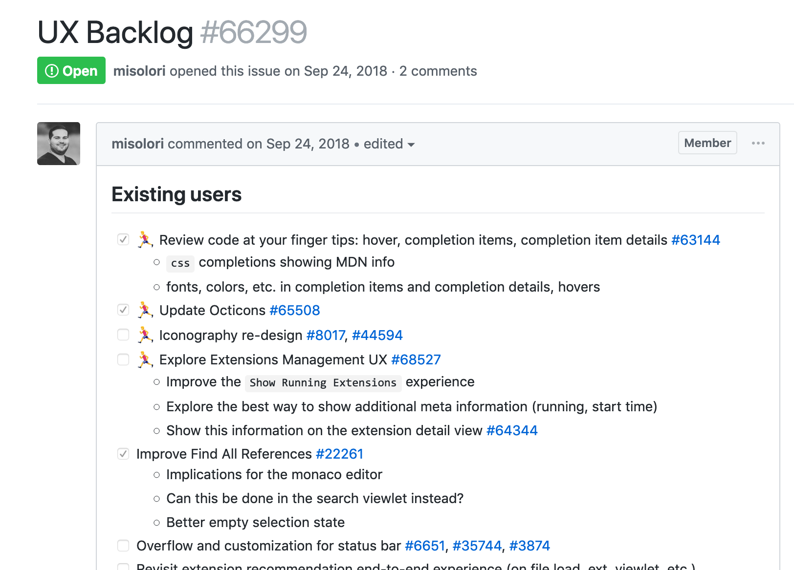

import { Head } from 'mdx-deck'
import { Layout, Inverted, BGImage, ImageLG, ImageXL } from './src/'
import { Split, SplitRight } from 'mdx-deck/layouts'

export default Inverted

# How To Work With Engineers

Miguel Solorio

<BGImage src={'./images/scared2.gif'} />
---
export default Layout

# 👋

My name is Miguel
---
export default Layout

# Designer @ D3 Studio
DevDiv Design

```notes
- D3 Studio = DevDiv Design
- Developer Division = DevDiv
- Cloud & AI
```
---
export default Layout

# D3 Studio

30 Designers - 5 Products - 4 Countries


---


#### Visual Studio IDE

---


#### Visual Studio for Mac
---


#### Visual Studio Code

---

---
export default Layout

# We work with A LOT of engineers
---
export default Layout

# Don't we all?
---
export default Layout


---
export default Split

# VS Code

Developers: 20

PMs: 2

Designers: 1

Researchers: 0.5
---
export default Layout

# 3 things I've learned
```notes
- What I've learned from working with an engineering team
```
---
export default Layout

# ⚠️ WARNING ️️⚠️

There are a lot of GIFs in this deck.

<small>Sorry, not sorry</small>
---
export default Layout

# 1. Speaking the language

---
export default Layout


## Talking to developers about design

```notes
- Sometimes developers aren't too enthusiastic about looking a static mockup
```
---
export default Layout


## Showing developers a prototype of a design

---
export default Layout


## Sending a developer a pull request for suggested changes
---
export default Layout

<ImageXL src={'./images/hello.gif'} />

```notes
- I realized this after not getting much feedback from the team
```

---
export default Layout


## Someone gave me a tip
---
export default Layout


### Learning how to build from source
---
export default Layout


### Making changes to the source code
---
export default Layout


#### 🎉 Created my first pull request on the team 🎉
---
export default Layout


### This was a game changer for me
---
export default Layout


### This taught me how to contribute to the team

---
export default Layout


### Learning the code base helped inform my design decisions & considerations
---
export default Layout


## Speeds up the design process
---
export default Layout



## Allowed me to be hands-on
---
export default Layout

Created **empathy** for my developers
---
export default Layout

# 2. Letting go of the design
---
export default Layout


When the team dislikes my designs
---
export default Layout


When a developer suggests design changes
---
export default Layout


When a developer changes the design
---
export default Layout

## I had to pause and reflect
---
export default Layout

Am I really **listening** to their feedback?
---
export default Layout

Am I involving them in the **design** process?
---
export default Layout


I wasn't being **inclusive**
---
export default Layout

Started **whiteboarding** with engineers
---
export default Layout

Started **wireframing** with engineers
---
export default Layout

Iterating on the feedback

**together** 

lead us to better & faster results
---
export default Layout

Involving **developers** into the **design process** allows them to be part of the solution
---
export default Layout


## When you do things together
---
export default Layout

# 3. Aligning design efforts
---
export default Layout


Little design impact
---
export default Layout


My work was not on the plan
---
export default Layout

**Weekly syncs** with the engineering manager
---
export default Layout

**Weekly UX syncs** with the team
---
export default Layout



Created a backlog
---
export default Layout


Tracked design work in the master plan
---
export default Layout

Nearly every UX item was tied to an area owner (dev)
---
export default Layout


## Freedom to explore
---
export default Layout


## Now it was on the plan
---
export default Layout

Team has **visibility** of design efforts
---
export default Layout

Community is able to give **feedback**
---
export default Layout

**Accountability** to follow through
---
export default Layout


## Getting involved

standups, sitdowns, demos, bug bashes, testing, lunch
---
export default Layout

You have a much **bigger impact** when you are **in sync** with your team
---
export default Inverted


## This text is invisible
---
export default Layout

# Summary
---
export default Layout

# 1. Speak the language

Informs your design decisions
---
export default Layout

# 2. Let go of the design

Be inclusive, design together
---
export default Layout

# 3. Align your design efforts

Get on same plan and integrate with your team
---
export default Layout

# 🙏

## Thank you